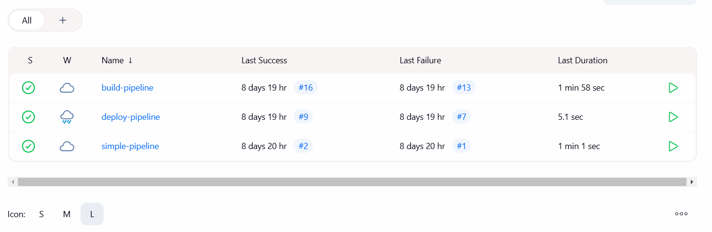
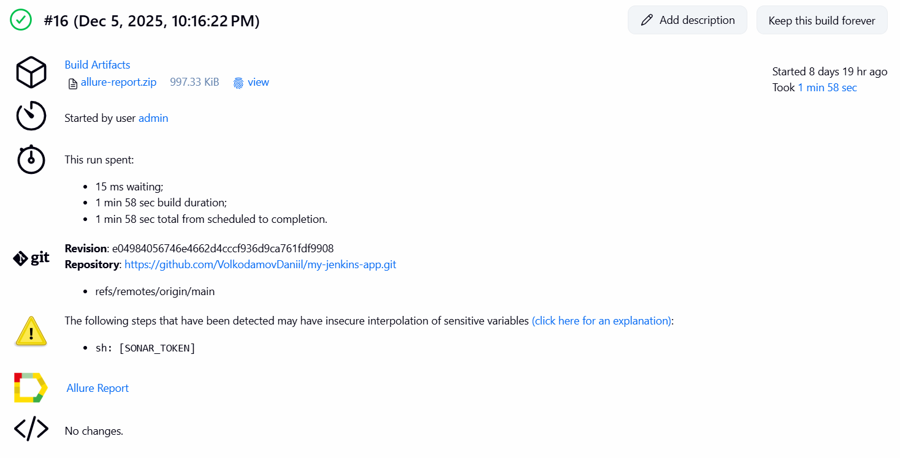
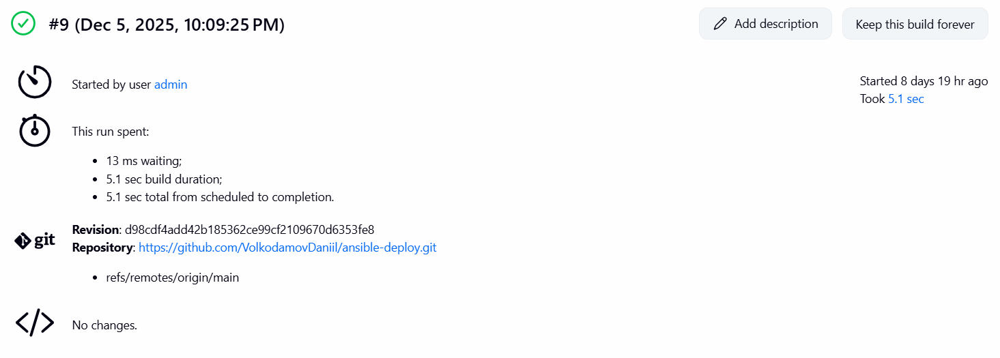
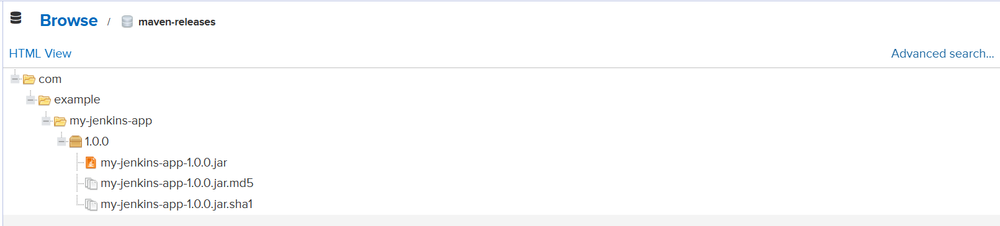

Запускаем `docker-compose up -d` в директории проекта.

Открываем веб-интерфейсы [Jenkins](http://localhost:8080/), [SonarQube](http://localhost:9000/), и [Nexus](http://localhost:8081/).

В логах Jenkins находим пароль, в SonarQube ставим свой, в Nexus помогает команда `docker exec nexus cat /nexus-data/admin.password`.

Затем переходим в графический интерфейс Jenkins, находим в настройки (Manage Jenkins), куда будем ещё возвращаться не раз. В разделе Tools устанавливаем JDK и Maven (даём имена и ставим галочки на Install automatically). Далее переходим в раздел Credentials, добавляя туда Nexus (nexus_cred) и SonarQube (sonar_token). Для Nexus необходимы логин и пароль, полученные на предыдущем шаге, а для SonarQube предварительно был сгенерирован токен (My Account → Security → Generate Tokens в веб-интерефейсе). Сам Nexus не требовал дополнительных настроек, все необходимые репозитории уже были созданы при первом запуске.

Далее переходим к созданиню pipeline'ов в Jenkins. Интерфейс интуитивный, были созданы `simple-pipeline` для примитивного тестирования, что хоть что-то вообще запускается, и `build-pipeline` и `deploy-pipeline` по заданию. 



В процессе неоднократных запусков пайплайны падали, а ошибки указывали на отсутствие некоторых плагинов в Jenkins. Таким образом, медленно, но верно, были установлены все необходимые плагины (в том же Manage Jenkins). Также потребовалось добавить в In-process Script Approval следующие сигнатуры:
```
method org.apache.maven.model.Model getArtifactId
method org.apache.maven.model.Model getGroupId
method org.apache.maven.model.Model getVersion
```

Сделано это было посредством скрипта во вкладке Script Console. Сам скрипт:
```groovy
import org.jenkinsci.plugins.scriptsecurity.scripts.ScriptApproval
import org.jenkinsci.plugins.scriptsecurity.scripts.languages.GroovyLanguage

def method = "method org.apache.maven.model.Model getArtifactId"
ScriptApproval.get().approveSignature(method)
ScriptApproval.get().approveSignature("method org.apache.maven.model.Model getGroupId")
ScriptApproval.get().approveSignature("method org.apache.maven.model.Model getVersion")

println "Methods approved!"
```

Наконец, когда все ошибки были исправлены и pipeline'ы наконец-то завершились успешно, можно убедиться в этом, заглянув в артефакты в Jenkins:


И в maven-releases в Nexus:



