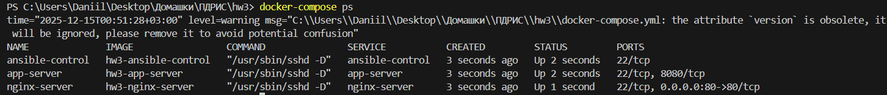
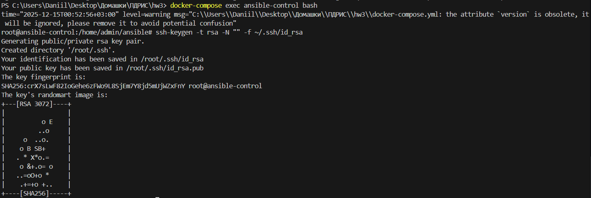
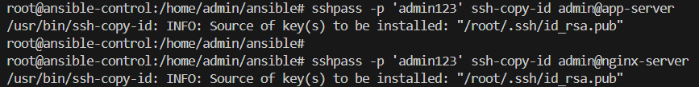
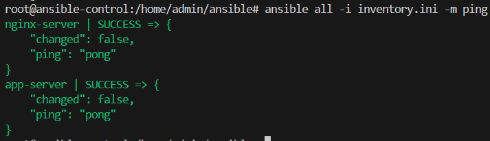
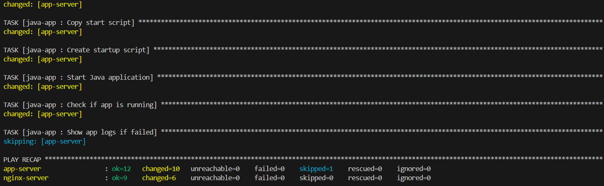
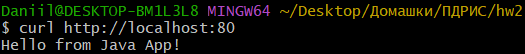
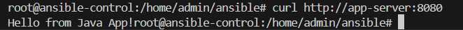

По классике проверяем `docker-compose ps`:

Заходим в контейнер и настраиваем ssh:

Проверяем подключение:

Также возникала необходимость ввести команду `chmod 755 /home/admin/ansible`, иначе не читался `ansible.cfg`.

Наконец, запуск плейбука `ansible-playbook playbooks/main.yml -i inventory.ini` и результат:

Также проверим корректность работы nginx и приложения напрямую:

