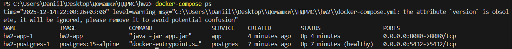
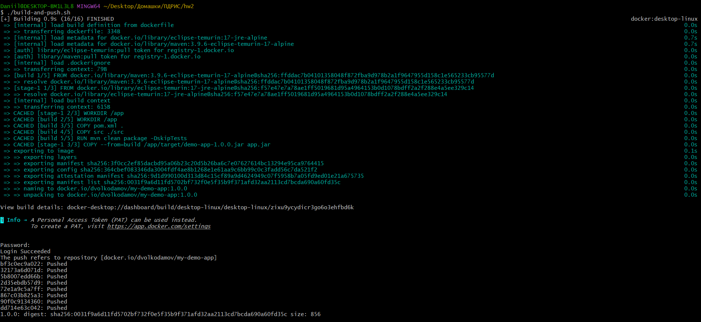
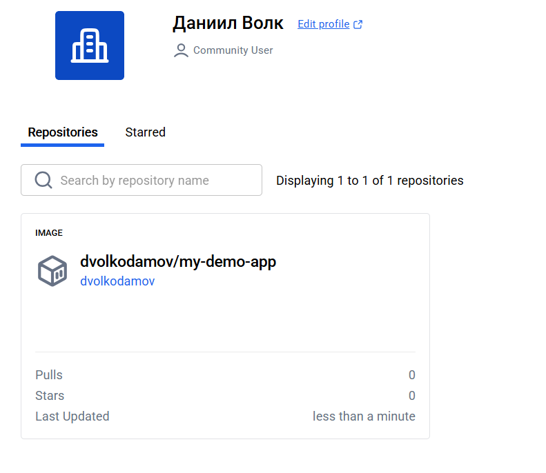
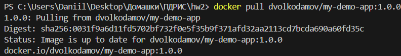
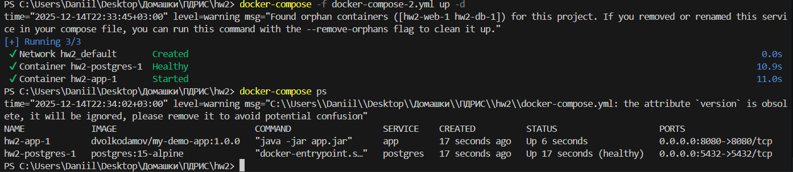
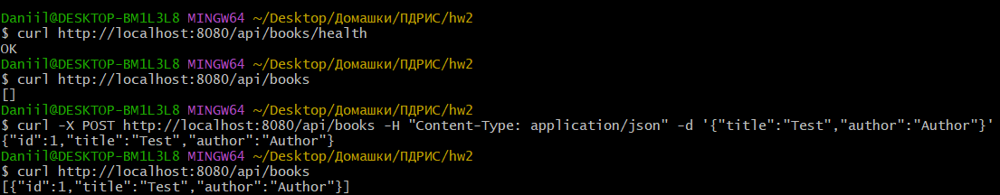

Собираем наше приложение с помощью `docker-compose up` и проверяем через `docker-compose ps`.

Запускаем скрипт отправки в registry:

Убеждаемся, что всё загрузилось, на https://hub.docker.com:

Также проверим работоспособность `docker pull`:

Теперь соберём приложение с образом из registry:

И убедимся, что оно работает:

